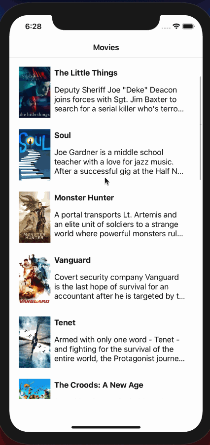

# Flixster-IOS
Code Path IOS Course Spring 2021 
# Flixster - Project 1

Flixster is an app that allows users to browse movies from the [The Movie Database API](http://docs.themoviedb.apiary.io/#).

##### Time Spent: ~4 hours

## Flixster Part 1

### User Stories

#### REQUIRED (10pts)
- [x] (2pts) User sees an app icon on the home screen and a styled launch screen.
- [x] (5pts) User can view and scroll through a list of movies now playing in theaters.
- [x] (3pts) User can view the movie poster image for each movie.

#### BONUS
- [ ] (2pt) User can view the app on various device sizes and orientations.
- [ ] (1pt) Run your app on a real device.

### App Walkthrough GIF
App launches and runs correctly

 

### Notes
Describe any challenges encountered while building the app.
- Familiarizing with xcode environment settings, layout, etc.. Tutorial has different xcode version so the tools require one to look for :)
- Installing pod correctly for project
- Understanding all settings for TableView, TableViewCell, basically all components used
- Understanding swift, different ballgame to what I'm accustomed to
- Reading documentation apart from tutorial was fun
